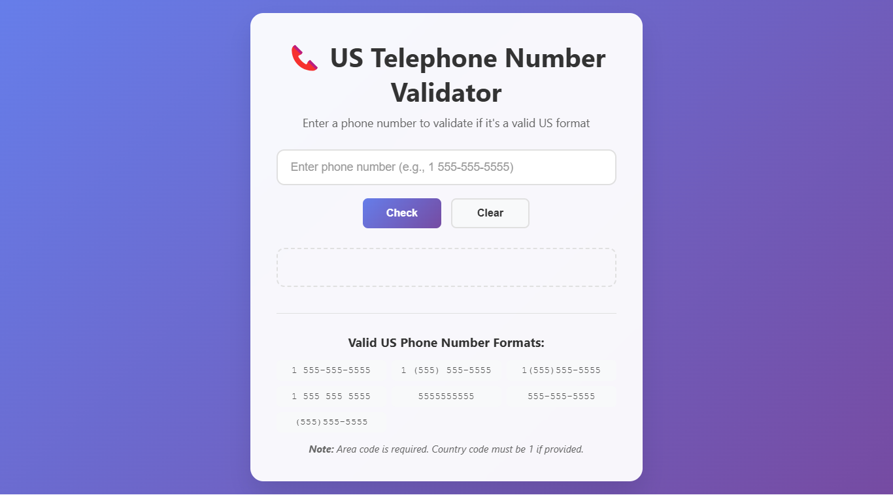

# 📞 Telephone Number Validator App


A comprehensive US telephone number validator that checks if phone numbers match valid US formats. Features intelligent pattern recognition, multiple format support, and real-time validation with clear visual feedback.

## 📸 Screenshots

<div align="center">
  
  <p><em>Professional phone number validator with format examples and validation results</em></p>
</div>

## ✨ Live Demo

🌐 **[View Telephone Number Validator App](https://telephone-number-validator-app-shib.vercel.app)**

## 🚀 Key Features

- **📞 US Format Validation**: Validates all standard US phone number formats
- **🔍 Pattern Recognition**: Advanced regex patterns for accurate validation
- **✅ Real-time Feedback**: Instant validation with clear success/error messages
- **📱 Multiple Formats**: Supports 7+ different US phone number formats
- **🎨 Clean Interface**: Professional design with intuitive user experience
- **⌨️ Keyboard Support**: Enter key support for quick validation
- **🧹 Clear Function**: Easy reset button to clear input and results
- **📋 Format Examples**: Built-in reference for valid phone number formats

## 🎨 Design Features

### Visual Elements
- **Professional Layout**: Clean, business-focused design
- **Color-coded Results**: Green for valid, red for invalid numbers
- **Format Examples**: Comprehensive list of supported formats
- **Responsive Design**: Works perfectly on all devices

### User Experience
- **Instant Validation**: Real-time feedback on phone number validity
- **Clear Instructions**: Helpful examples and format guidelines
- **Error Prevention**: Input guidance and format suggestions
- **Accessibility**: Screen reader friendly with proper ARIA labels

## 📱 Core Functionality

1. **📞 Phone Input** - Enter US phone number in any supported format
2. **✅ Validation** - Check if number matches valid US patterns
3. **📊 Result Display** - Clear visual indication of validity
4. **🧹 Clear Function** - Reset input and results with one click
5. **📋 Format Guide** - Reference examples for valid formats
6. **⌨️ Keyboard Support** - Enter key for quick validation

## 🛠️ Tech Stack

- **⚡ Frontend**: HTML5, CSS3, Vanilla JavaScript
- **🔍 Validation**: Regular Expressions (RegEx) for pattern matching
- **🎨 Styling**: CSS Flexbox, Modern UI components
- **📱 Responsive**: Mobile-first responsive design
- **♿ Accessibility**: WCAG compliant with semantic HTML

## 🚀 Getting Started

### Prerequisites

- Modern web browser with JavaScript enabled
- No additional dependencies required

### Installation

1. **Clone the repository**
   ```bash
   git clone https://github.com/your-username/telephone-number-validator-app.git
   cd telephone-number-validator-app-shibam
   ```

2. **Open the application**
   ```bash
   # Option 1: Open directly in browser
   open index.html
   
   # Option 2: Use a local server (recommended)
   python -m http.server 8000
   # or
   npx serve .
   ```

3. **Start validating phone numbers**
   - Enter a US phone number in any format
   - Click "Check" or press Enter
   - View validation result with clear feedback

## 📁 Project Structure

```
telephone-number-validator-app-shibam/
├── 📄 index.html              # Main HTML structure
├── 🎨 styles.css              # Styling and responsive design
├── ⚡ script.js               # Validation logic and RegEx patterns
├── 📸 screenshot/             # Application screenshots
├── 📖 README.md               # Project documentation
├── 📜 LICENSE                 # MIT License
└── 🚫 .gitignore              # Git ignore rules
```

## 🛠️ Technologies Used

<table>
<tr>
<td align="center"><br><b>HTML5</b></td>
<td align="center"><br><b>CSS3</b></td>
<td align="center"><br><b>JavaScript</b></td>
<td align="center"><br><b>RegEx</b></td>
<td align="center"><br><b>Git</b></td>
</tr>
</table>

## 🎯 Validation Features

### Supported US Phone Number Formats
1. **1 555-555-5555** - Country code with dashes
2. **1 (555) 555-5555** - Country code with parentheses and dashes
3. **1(555)555-5555** - Country code with parentheses, no spaces
4. **1 555 555 5555** - Country code with spaces
5. **5555555555** - 10 digits only
6. **555-555-5555** - Area code with dashes
7. **(555)555-5555** - Area code with parentheses

### Validation Rules
- **Area Code Required**: All numbers must include a valid area code
- **Country Code**: If provided, must be "1" (US country code)
- **10-Digit Minimum**: Must contain exactly 10 digits (excluding country code)
- **Format Flexibility**: Accepts various spacing and punctuation patterns
- **Invalid Formats**: Rejects incomplete numbers, wrong country codes, invalid characters

## 🧮 Usage Examples

### Valid Phone Numbers
- **✅ 1 555-555-5555** - Standard format with country code
- **✅ (555) 555-5555** - Parentheses format
- **✅ 555.555.5555** - Dot-separated format
- **✅ 5555555555** - Numbers only
- **✅ 1(555)555-5555** - Compact format

### Invalid Phone Numbers
- **❌ 555-5555** - Missing area code
- **❌ 2 555-555-5555** - Wrong country code
- **❌ 555-555-55555** - Too many digits
- **❌ (555)5555555** - Incorrect format
- **❌ 123-456-789** - Too few digits

## 🔍 Regular Expression Pattern

The app uses sophisticated regex patterns to validate US phone numbers:

```javascript
// Main validation pattern
const phoneRegex = /^(1\s?)?(\([0-9]{3}\)|[0-9]{3})[\s\-]?[0-9]{3}[\s\-]?[0-9]{4}$/;

// Pattern breakdown:
// ^(1\s?)? - Optional country code "1" with optional space
// (\([0-9]{3}\)|[0-9]{3}) - Area code with or without parentheses
// [\s\-]? - Optional space or dash separator
// [0-9]{3} - First 3 digits of phone number
// [\s\-]? - Optional space or dash separator
// [0-9]{4}$ - Last 4 digits of phone number
```

## 🌐 Deployment

### 🚀 Quick Deploy Options

1. **GitHub Pages**
   - Push to GitHub repository
   - Enable GitHub Pages in repository settings
   - Access via `https://username.github.io/repository-name`

2. **Netlify**
   - Drag and drop project folder to Netlify
   - Get instant live URL with HTTPS

3. **Vercel**
   - Import GitHub repository
   - Zero-configuration deployment

## 📊 Performance Features

- **Lightweight**: Minimal code footprint for fast loading
- **Efficient Regex**: Optimized pattern matching for quick validation
- **No Dependencies**: Pure vanilla JavaScript for maximum compatibility
- **Fast Rendering**: Optimized DOM manipulation for smooth performance

## 🔧 Available Scripts

```bash
# Development
python -m http.server 8000    # Start local development server
npx serve .                   # Alternative local server

# Testing
# Test with various phone number formats
# Verify validation accuracy with edge cases
```

## 🧪 Testing Examples

### Test Valid Numbers
- **Standard**: 1 555-555-5555
- **Parentheses**: 1 (555) 555-5555
- **Compact**: 1(555)555-5555
- **Spaces**: 1 555 555 5555
- **Numbers Only**: 5555555555
- **Dashes**: 555-555-5555
- **Parentheses Only**: (555)555-5555

### Test Invalid Numbers
- **Missing Area Code**: 555-5555
- **Wrong Country Code**: 2 555-555-5555
- **Too Many Digits**: 555-555-55555
- **Too Few Digits**: 555-555-555
- **Invalid Characters**: 555-abc-5555
- **Incomplete**: (555)555-

## 📞 US Phone Number Standards

### North American Numbering Plan (NANP)
- **Format**: NXX-NXX-XXXX (where N = 2-9, X = 0-9)
- **Area Codes**: 3-digit codes for geographic regions
- **Exchange Codes**: 3-digit codes for local exchanges
- **Subscriber Numbers**: 4-digit unique numbers within exchange

### Validation Criteria
- **Total Length**: 10 digits (plus optional country code)
- **Area Code**: Cannot start with 0 or 1
- **Exchange Code**: Cannot start with 0 or 1
- **Country Code**: Must be 1 if provided

## ♿ Accessibility Features

- **Semantic HTML**: Proper form structure and labeling
- **Keyboard Navigation**: Full keyboard support with Enter key
- **Screen Reader Support**: ARIA labels and descriptive text
- **High Contrast**: Clear visual distinction between elements
- **Focus Management**: Visible focus indicators

## 📝 License

This project is open source and available under the [MIT License](LICENSE).

## 🤝 Contributing

Contributions, issues, and feature requests are welcome! Feel free to check the [issues page](https://github.com/your-username/telephone-number-validator-app/issues).

## 📞 Contact

**Shibam Banerjee**
- Email: Connect-With-Shibam@outlook.com
- Phone: +91 62902-18960
- LinkedIn: [linkedin.com/in/shibam-webdev](https://linkedin.com/in/shibam-webdev)
- GitHub: [github.com/Shibam-Code-Pro](https://github.com/Shibam-Code-Pro)

## 🙏 Acknowledgments

- [freeCodeCamp](https://www.freecodecamp.org/) for algorithm challenges and inspiration
- [MDN Web Docs](https://developer.mozilla.org/) for Regular Expression documentation
- [NANP](https://www.nanpa.com/) for North American Numbering Plan standards

---

⭐ **If you found this project helpful, please give it a star!** ⭐
